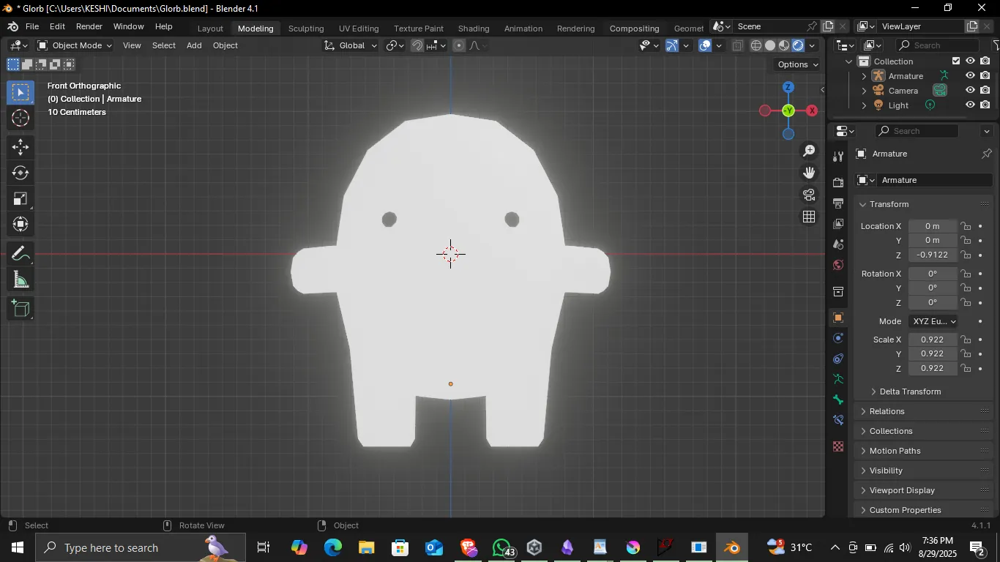

# Glorb is Missing and John cannot See

## Story Summary
John breaks his glasses and his intergalactic pet Glorb goes missing. John cannot see very well without glasses.John needs to decide when to wear and remove his very broken glasses in order to navigate his surroundings.

## Glorb

## Core Experience 
Glorb is adorable. You wouldn’t want him to get lost would you. If you wear your absolutely shattered to the core glasses, you’ll experience janky movements because the Player’s DOF is not the greatest.

## Game Flow Summary
1. John loses his phone, John breaks his glasses
2. John finds his phone, the player gets a sense of the mechanic (remove and wear glasses)
3. Glorb loves food. John sees posters of Glorb’s favorite food. and an arrow pointing towards the stall. (wear glasses)
4. Recognize pattern in constellation to go the right path to find battery to light up the food stall to attract Glorb. (remove glasses)
5. John finds battery. John still needs wires
6. <insert cool task>
7. John lights up the stall. yay. Greedy glorb gets attracted to the stall. Happy ending.

## Look and Feel
1. Very PSX, Low Poly 3D First Person
2. Dark Moody Atmosphere
3. Bit Audio 
